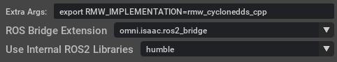
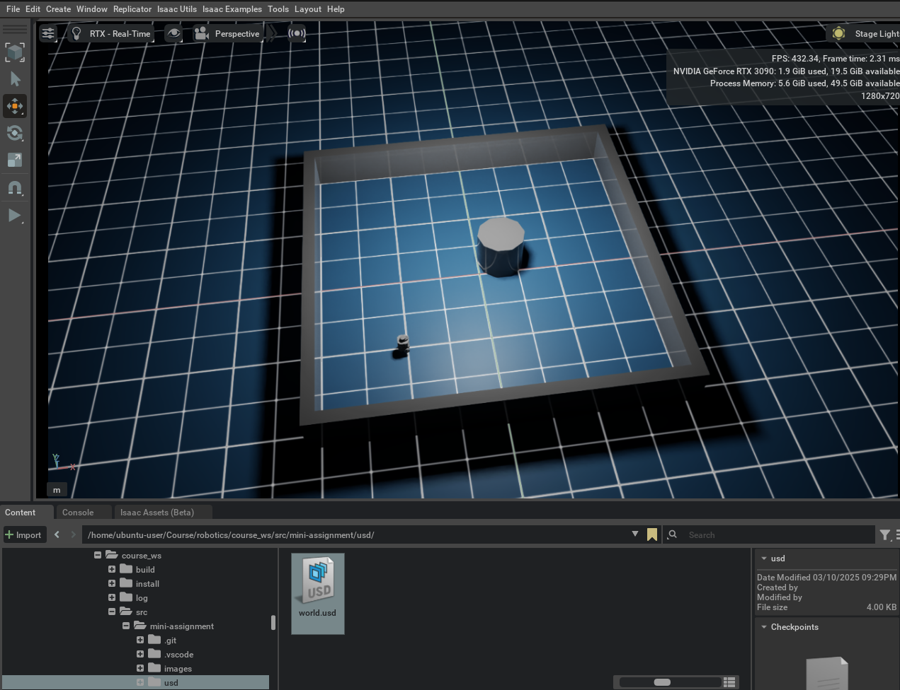

# Mini Assignment

## Introduction
This project demonstrates a proportional controller designed to navigate a wheeled robot to a specified target.


## Instructions
1. Navigate to the `mini-assignment` directory.

2. Configure the environment:
    ```bash
    . ./set_conda.sh 
    ```

3. To install the required package, run:
```bash
pip install transforms3d
```

4. Execute the program:
    ```bash
    python move_to_point_example.py
    ```

# Docker ROS 2: Publish Twist to Robot in Isaac Sim 
## Local Environment Setup
### Build Docker ROS 2 Image
1. Navigate to the directory containing the `DOCKERFILE`.

2. Build the Docker image:
    ```bash
    docker build -t <YOUR_IMAGENAME> .
    ```

3. Run the Docker container, replacing `<YOUR_CONTAINER_NAME>` and `<YOUR_IMAGENAME>`:
    ```bash
    docker run -it \
        --name <YOUR_CONTAINER_NAME> \
        --network host \
        --env="DISPLAY" \
        --env="QT_X11_NO_MITSHM=1" \
        --volume="/tmp/.X11-unix:/tmp/.X11-unix:rw" \
        --volume="<YOUR_PATH>/humble_ws:/root/humble_ws" \
        <YOUR_IMAGENAME>
    ```
    Example:
    ```bash
    docker run -it \
        --name humble-container \
        --network host \
        --env="DISPLAY" \
        --env="QT_X11_NO_MITSHM=1" \
        --volume="/tmp/.X11-unix:/tmp/.X11-unix:rw" \
        --volume="/home/ysy/shiyuan_ws/humble_ws:/root/humble_ws" \
        humble-image
    ```

4. Start the Docker container and access its shell:
    ```bash
    docker start <YOUR_CONTAINER_NAME> && docker exec -it <YOUR_CONTAINER_NAME> /bin/bash
    ```
    If `rviz` is needed, run the following command to allow local connections to the X server from the specified Docker container:
    ```bash
    xhost +local:$(docker inspect --format='{{ .Config.Hostname }}' <YOUR_CONTAINER_NAME>) && docker start <YOUR_CONTAINER_NAME> && docker exec -it <YOUR_CONTAINER_NAME> /bin/bash
    ```
5. To start the isaacsim using terminal, run:
```bash
cd ~/.local/share/ov/pkg/isaac-sim-4.2.0
. ./isaac-sim.selector.sh 
```

6. Launch Isaac Sim with ROS 2 Support
When launching Isaac Sim from the NVIDIA Omniverse Launcher, set `export RMW_IMPLEMENTATION=rmw_cyclonedds_cpp` under "Extra Args" to ensure it uses the correct ROS 2 configuration.



6. When isaacsim start, import environment usd file by navigate to <mini-assignment/usd/world.usd> at content  



### Inside Docker Container
#### Set ROS_DOMAIN_ID
To set the `ROS_DOMAIN_ID` and avoid communication conflicts, add the following line to your `~/.bashrc` file:
```bash
echo 'export ROS_DOMAIN_ID=<a number>' >> ~/.bashrc
. ~/.bashrc
```
You can find your ROS_DOMAIN_ID in this [link](https://docs.google.com/spreadsheets/d/1kC7gXXYbdRqgV7mz5oa8AHA5-ZvLCW_N/edit?gid=1509629307#gid=1509629307).


#### Publish ROS 2 Twist Command
To publish a twist command, run:
```bash
ros2 run teleop_twist_keyboard teleop_twist_keyboard
```

#### Use Alias for Shortcuts
You can find alias commands in `~/.bashrc` in your docker container. Use:
```bash
vim ~/.bashrc  
. ~/.bashrc
```
to modify or create your own shortcut commands.
